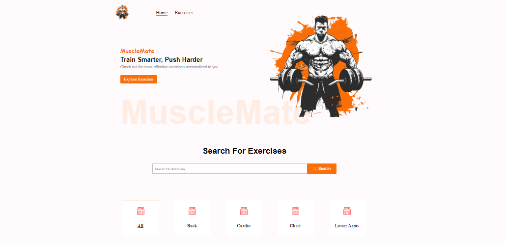

# MuscleMate: The Gym Exercise App

### Description.

MuscleMate is a feature-rich React.js app designed for fitness enthusiasts. MuscleMate is a beautifully designed, responsive React.js app that helps you explore and discover exercises tailored to your fitness needs. It allows users to search for exercises, provides relevant data pulled from an API, and offers YouTube video tutorials for each exercise.

### Functionalities.

You can search for exercises, view detailed results fetched from an API, watch YouTube tutorials, and explore similar exercises. With easy navigation and exercise details at your fingertips, MuscleMate ensures a seamless user experience across all devices.
